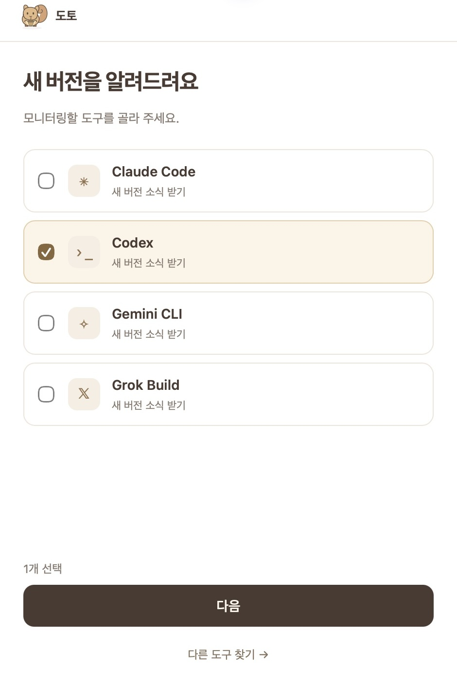
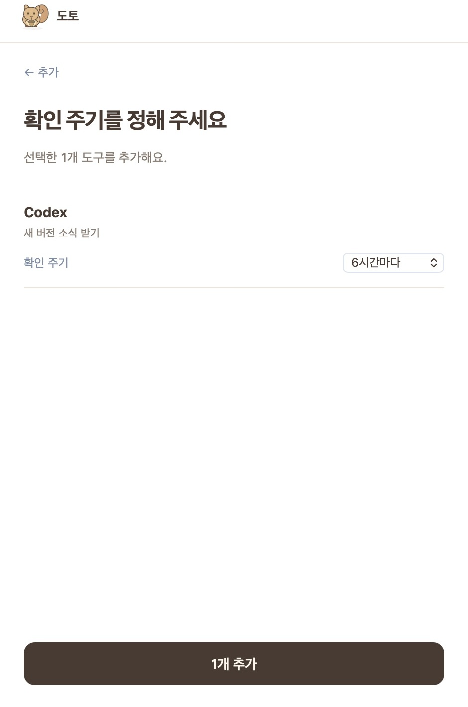
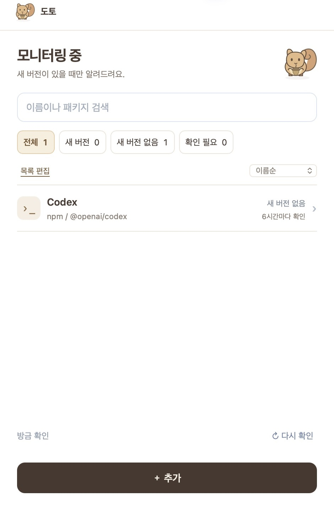
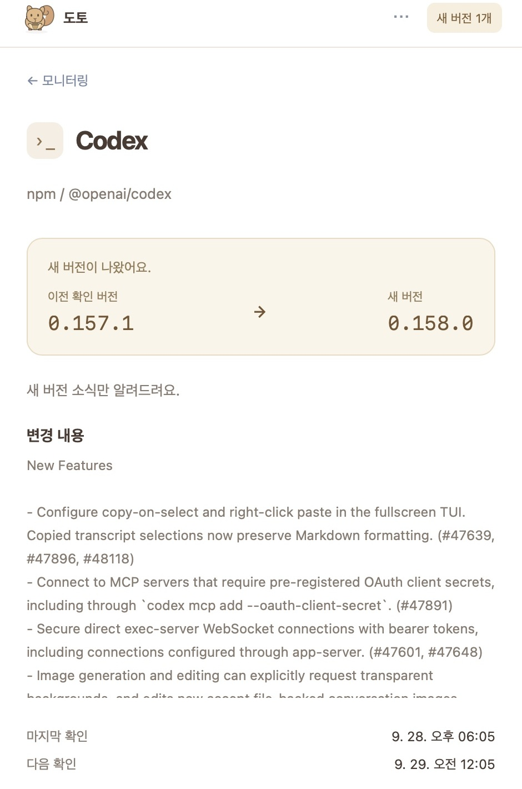

# 도토 (Doto)

**내가 쓰는 개발 도구에 새 버전이 나오면, 도토가 알려줘요.**

도구마다 새 버전이 나왔는지 찾아보는 일이 번거로웠나요? 도토에 필요한 도구만 등록해 두세요. 정해 둔 주기로 확인하고, 새 버전이 있을 때 알려주는 맥 앱입니다.

## 도토로 할 수 있어요

- **필요한 도구만 모니터링해요.** 자주 쓰는 도구를 고르고 각각의 확인 주기를 정할 수 있습니다.
- **창을 계속 켜두지 않아도 돼요.** 창을 닫아도 메뉴 막대에서 실행되며, 새 버전이 나오면 알려줘요.
- **원하는 항목을 함께 업데이트해요.** 업데이트 가능한 항목 중 원하는 것만 고르거나 전체를 선택하고, 각각의 결과를 확인할 수 있습니다.

## Codex의 새 버전 소식을 받아볼까요?

**선택 → 주기 설정 → 모니터링 → 알림 → 변경 내용 확인**

아래는 실제 맥 앱에서 촬영한 하나의 사용 흐름입니다. 새 버전이 나오는 상황은 시연용으로 재현했으며, 설정한 주기의 대기 시간은 생략했어요.

### 1. Codex를 골라요

자주 쓰는 도구를 미리 준비했어요. 여기서는 Codex 하나를 선택하고 **다음**을 누릅니다.



### 2. 확인 주기를 정해요

**6시간마다** 확인하도록 정하고 **1개 추가**를 눌러 주세요.



### 3. 이제 창을 닫아도 돼요

Codex가 모니터링 목록에 추가됐습니다. 새 버전이 없으면 조용히 확인을 이어가요.



### 4. 새 버전이 나오면 도토가 알려줘요

창을 닫아 둔 상태에서도 알림이 나타납니다. **내용 보기**를 눌러 주세요.


### 5. 무엇이 달라졌는지 확인해요

알림을 누르면 해당 도구의 상세 화면으로 이동해요. 이전 버전과 새 버전, 공식 릴리스의 변경 내용을 확인할 수 있습니다.



이 시연은 설치하지 않은 Codex의 **새 버전 소식만 받는 경우**예요. 도토에서 업데이트를 지원하는 설치 도구는 **한꺼번에 업데이트**로 원하는 항목을 함께 업데이트할 수 있습니다.

## 다른 도구도 연결할 수 있어요

‘직접 입력’에서 GitHub 주소나 npm 패키지 이름을 입력하고, 내 컴퓨터에 설치된 도구를 연결하세요. 설치 버전과 새 버전을 비교해 알려드립니다.

- npm 패키지와 설치 위치가 정확히 하나로 식별되면 자동으로 연결해요.
- 그 외에는 설치된 앱이나 패키지를 고르세요. 목록에 없으면 앱이나 CLI 실행 파일을 직접 선택할 수 있습니다.
- 설치하지 않았다면 **소식만 구독**을 선택하세요. 설치 상태와 비교하지 않고 새 릴리스 소식을 알려드립니다.

직접 연결한 앱과 CLI의 업데이트는 해당 도구에서 진행합니다.

<details>
<summary>같은 도구가 여러 곳에 설치되어 있다면</summary>

도구 상세에서 사용할 설치 위치를 선택해 주세요. 도토는 선택한 위치의 버전을 확인하고 업데이트합니다.

</details>

## 창을 닫은 뒤에는

메뉴 막대의 **도토**에서 다시 열 수 있어요. 앱을 완전히 종료하려면 `Cmd+Q`를 누르세요. 앱이 종료되거나 맥이 잠들어 있는 동안에는 새 버전을 확인하지 않습니다.

## 설치 안내

**설치 파일 공개를 준비하고 있어요.** 현재는 소스와 시연 화면을 공개하며, 다른 맥에서의 첫 실행 확인이 남아 있습니다.

macOS 13 이상에서 Xcode Command Line Tools가 설치되어 있다면, 터미널에 아래 세 줄을 붙여넣으세요. 처음에는 인터넷 연결이 필요합니다.

```sh
git clone https://github.com/JeonJe/doto.git &&
cd doto &&
bash macos/build.sh && open dist/Doto.app
```

빌드가 끝나면 도토가 열려요. 다음부터는 `doto/dist/Doto.app`을 더블클릭하면 됩니다.

개발자 도구 설치와 테스트 방법은 [개발 안내](docs/DEVELOPMENT.md)를 확인하세요.
