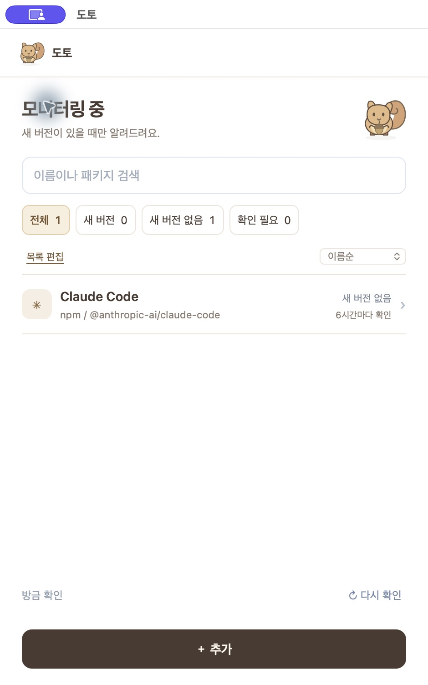
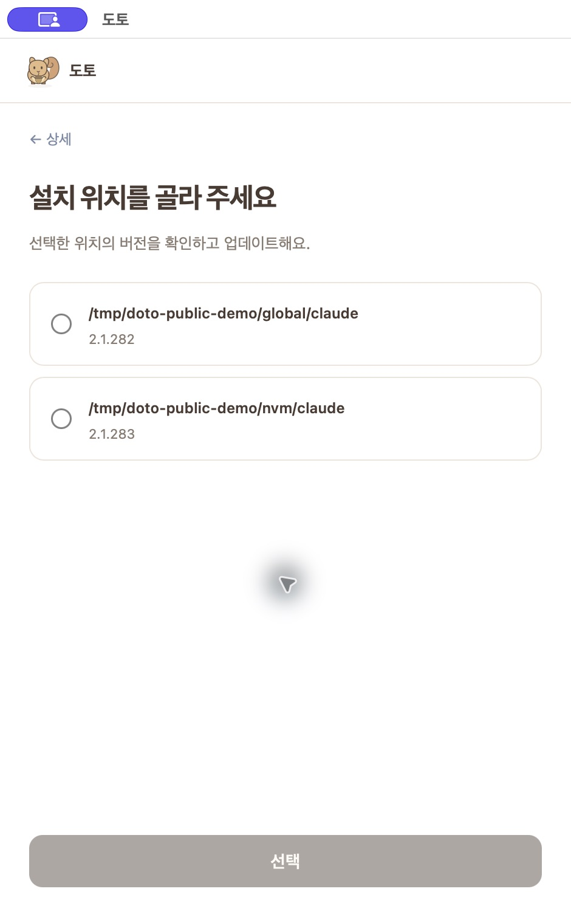

# 도토 (Doto)

**내가 쓰는 개발 도구에 새 버전이 나오면, 도토가 알려줘요.**

도구마다 새 버전이 나왔는지 찾아보는 일이 번거로웠나요? 도토에 필요한 도구만 등록해 두세요. 정해 둔 주기로 확인하고, 새 버전이 있을 때 알려주는 맥 앱입니다.

## 도토로 할 수 있어요

- **필요한 도구만 모니터링해요.** 자주 쓰는 도구를 고르고 각각의 확인 주기를 정할 수 있습니다.
- **창을 계속 켜두지 않아도 돼요.** 창을 닫아도 메뉴 막대에서 실행되며, 새 버전이 나오면 알려줘요.
- **원하는 항목을 함께 업데이트해요.** 업데이트 가능한 항목 중 원하는 것만 고르거나 전체를 선택하고, 각각의 결과를 확인할 수 있습니다.

*시연용 데이터로 촬영한 화면입니다.*

## 이렇게 사용해요

1. **도구를 골라요.** Claude Code, Codex, Gemini CLI, Grok Build를 미리 준비했어요. 다른 도구는 ‘다른 도구 찾기’에서 추가합니다.
2. **확인 주기를 정해요.** 도구마다 얼마나 자주 새 버전을 확인할지 선택하세요.
3. **알림이 오면 내용을 살펴봐요.** 해당 도구의 버전을 확인하고, 제공되는 릴리스 노트나 패키지 정보를 열어볼 수 있습니다.
4. **업데이트할 항목을 선택해요.** ‘한꺼번에 업데이트’에서 원하는 항목을 고르세요. 결과는 항목별로 보여드려요.

설치하지 않은 도구도 새 버전 소식만 받을 수 있습니다. 이런 항목은 업데이트 대상에서 제외돼요.

같은 도구가 여러 곳에 설치되어 있다면

도구 상세에서 사용할 설치 위치를 선택해 주세요. 도토는 선택한 위치의 버전을 확인하고 업데이트합니다.

*위 경로와 버전은 시연용입니다.*

## 창을 닫은 뒤에는

메뉴 막대의 **도토**에서 다시 열 수 있어요. 앱을 완전히 종료하려면 `Cmd+Q`를 누르세요. 앱이 종료되거나 맥이 잠들어 있는 동안에는 새 버전을 확인하지 않습니다.

## 설치 안내

**설치 파일 공개를 준비하고 있어요.** 현재는 소스와 시연 화면을 공개하며, 다른 맥에서의 첫 실행 확인이 남아 있습니다.

소스에서 직접 실행하려면 [개발 안내](docs/DEVELOPMENT.md)를 참고하세요.
